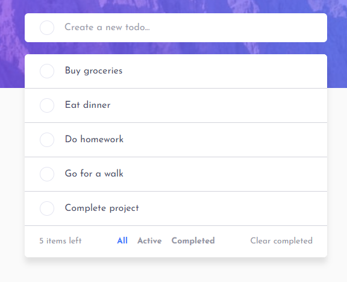
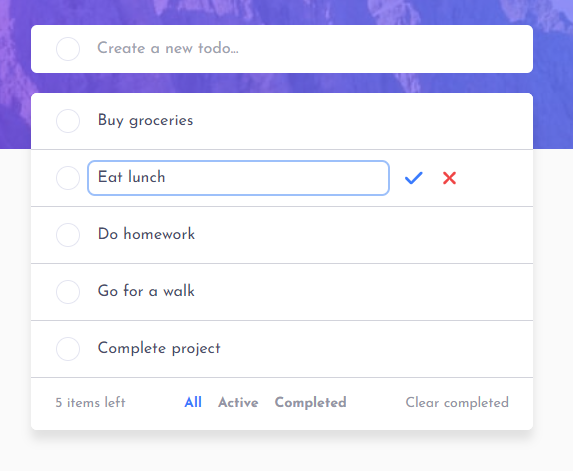
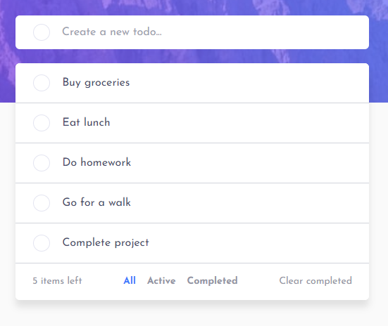

# Todo List App

This project is a Frontend Mentor challenge project that utilizes HTML, Tailwind CSS, React, and Redux to create a mobile first responsive todo list app. The application allows users to add, remove, edit, and manage todos. Users are also able to view a list of all, active, or completed todos, and also has the option to clear all completed todos from the list. Options for switching between light mode and dark mode are available, and all of the changes, whether it be the mode or the todos, will be saved to local storage.

**View a list of todos:**  

**Upon editing a todo, users have the option to either confirm the edit or revert the edit back to what it original was:**  

**When confirming the todo edit, the content of the initial todo will be changed:**  

 
## View Site

Link: https://deepgit-todo-list.netlify.app/

## Technologies Utilized

- HTML
- Tailwind CSS
- React
- Redux
- Vite
